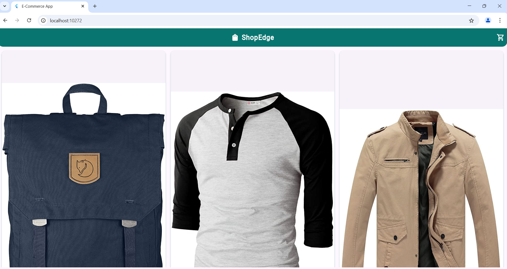

# final_exam_flutter

A new Flutter e-commerce app to display a list of products fetched from the API. I used http package.

The app includes:

API Integration: Fetched product data from https://fakestoreapi.com/products using the http package.

Product Grid: Displayed all products in a clean 3-column GridView layout.

Product Card: Each card shows the product image, title, and price, with image caching for faster loading.

Add to Cart Navigation: Clicking "Add to Cart" takes the user to a detailed page for that product.

Product Details Page: Displays full product details including a centered image, name, price, and description.

Modern UI: Used Material Design components, custom AppBar, and styled buttons for a polished user interface.

